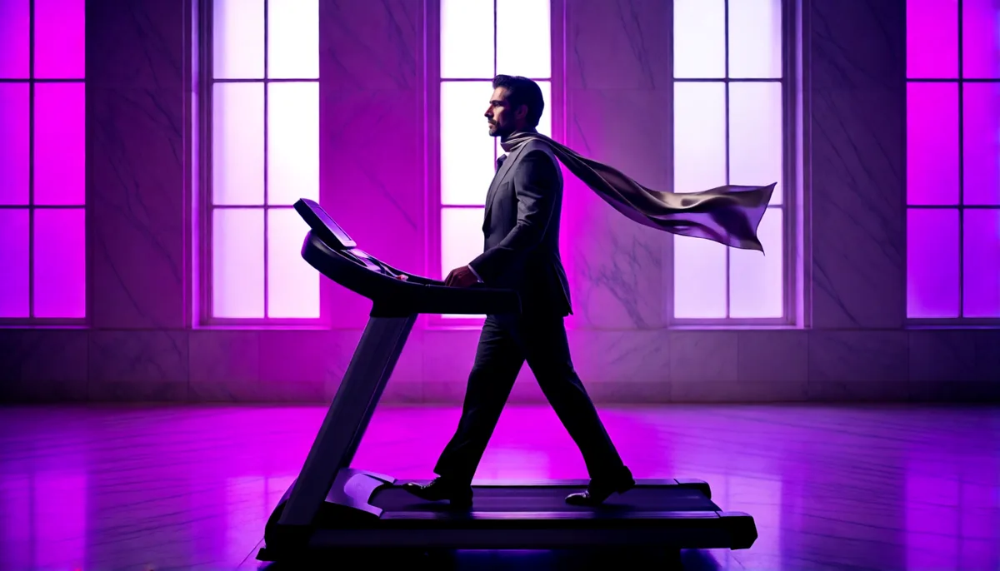

# seamless-loop-video



Agent skill: looping ambient video from a still (MiniMax H3 in ComfyUI), with scripts to measure motion and build clean loops.

An agent skill from [VIOLINET Tech](https://github.com/Violinet-tech). It is a folder with a `SKILL.md`, written from a real job and the mistakes made on the way. It works in Claude Code and any harness that reads the `SKILL.md` format, and the markdown is readable as plain docs without an agent.

Page: https://violinet-tech.github.io/seamless-loop-video/

## Use it when

you want a looping ambient video from a still image (MiniMax H3 in ComfyUI), or a loop jumps at the seam or barely moves.

## Install

Clone it into your skills folder. The folder name must match the `name:` in `SKILL.md`, which is why it is cloned under that name:

```bash
git clone https://github.com/Violinet-tech/seamless-loop-video ~/.claude/skills/seamless-loop-video
```

For one project only, clone into `.claude/skills/seamless-loop-video` instead.

## What's inside

- `SKILL.md`: the skill
- `scripts/make-loop.py`, `scripts/seamless.py`, `scripts/chain.py`: build and measure loops. Set `COMFY_URL` if your ComfyUI is not on `http://127.0.0.1:8188`.

## More skills

See [all VIOLINET Tech skills](https://github.com/orgs/Violinet-tech/repositories?q=topic%3Aagent-skills).

## Contributing

Issues and PRs welcome. Keep it generic: no personal paths, keys or machine addresses.

## License

MIT, see [LICENSE](LICENSE).
